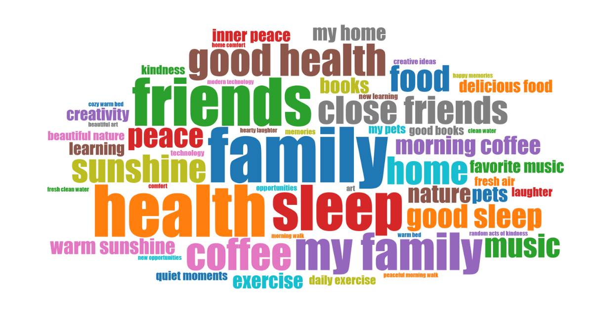

# Wall of Gratitude

> _You can't be grateful and anxious at the same time_

Consciously practicing gratitude is something that consistently makes me feel good - but I do it way too little.

That's why I built this app.

## How It Works

It's very simple:

1. Make https://wog.niklasluehr.com your browser start page
2. Now every time you open your browser, you are prompted to enter three things you're grateful for
3. Watch your Wall of Gratitude grow every day ✨

Depending on how often an entry or word occurs, they are rendered bigger or smaller.

### Run on Startup on Windows

You can also run the app on Startup:

1. Press Windows Key + R
2. Type "shell:startup"
3. Create a link to `start-wall-of-gratitude.bat` inside the startup folder

### Privacy, Import & Export

**All data is always only stored locally in your browser.**
To move the data to a new browser, use the export and import buttons.

---

MIT License
**Made with gratitude by [niklasluehr.com](https://niklasluehr.com)**
